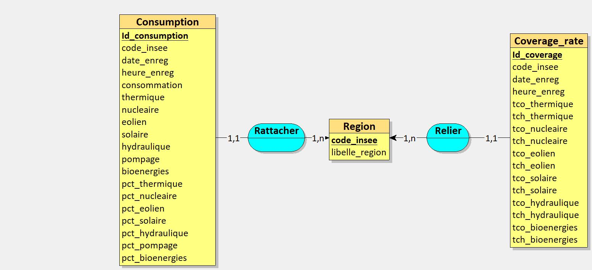

# Building of the database

In order to storage the data collect every month by the API, a database was built. The choice for this database is the PostgreSQL.
Data are structured and they are only collected in batch mode, thus it is more pertinent to use a SQL database in this case.
First, the database was built locally in order to do different tests with the differents tools. Secondly, this database will be deployed with Docker.

## Local Setting

The local development was here in order to prepare the script of building the database and the different tables belonging to this database.

## Conceptual model of the data

This is the entity/association schema of the database. The tool used to realise it is [Looping](https://www.looping-mcd.fr/).

