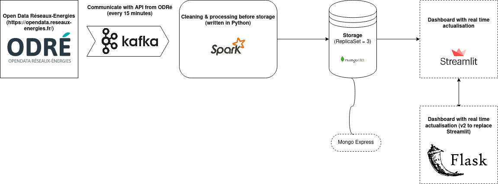

# Energy consumption and production in France, region by region, in real time

*Update: 05/01/2023*

This projects used a kappa architecture. This kind of architecture is optimized to process data in real time. A kappa architecture is caracterized by different components :
- a component which collects data
- a component which processes data
- a component which stores data
- a component which displays data.

The architecture used is summarized in this schema.



## Table of contents
* [General info](#general-info)
* [Folder organisation](#folder-organisation)
* [Technologies](#technologies)
* [Setup](#setup)
* [Status](#status)
* [Credits](#credits)

## General Info

From the API of the Open Data Réseaux Energie (ODRé), data are collected with a Kafka broker. This data are processed by a Spark application before being stored in a MongoDB database. Finally, a dashboard is used to visualize the data inside the database. 
Initially, this dashboard was made using the Streamlit library. However, tools such as Streamlit are not suitable for Big Data problems. 

Therefore, a new version of the dashboard will be developed with Dash and Plotly.
This application has been developed in different microservices. This process can allow us to containerize each microservices in several Docker containers.

## Folder organisation

```
└── Energy_consumption/
    └── app/
        ├── images/
        ├── packages/
            └── module_kafka.py
        ├── app.py
        ├── dashboard.py
        ├── producer.py
        ├── Dockerfile_dashboard
        ├── Dockerfile_kafka-component
        ├── Dockerfile_spark-component
        ├── Dockerfile_spark-job
        └── requirements.txt
    ├── .gitignore
    └── README.md
```
## Technologies

Technologies used in this project are:

- [Apache Kafka](https://kafka.apache.org/documentation/)
- [Apache Spark](https://spark.apache.org/)
- [API ODRé](https://odre.opendatasoft.com/api/v2/console)
- [Dash](https://dash.plotly.com/)
- [Docker](https://www.docker.com/)
- [Kubernetes](https://kubernetes.io/fr/)
- [MongoDB](https://www.mongodb.com/)
- ~~[Streamlit](https://streamlit.io/)~~ (replaced in v2)

## Setup

1) Clone the repository in your computer.
2) Run this project:
```
docker-compose up 
```
3) Access to the dashboard in your browser:
```
0.0.0.0:8050
```
## Status

- v1: **Archived** 
    - Performance issue of the dashboard when the DB contains too much data

- v2: **In development** 
    - ~~Modification of the dashboard in order to obtain  better performance whatever the amount of data~~
    - ~~Addition of data processing with Apache Spark~~
    - Addition of replicatSet in MongoDB (in progress).

## Credits

- Cécile Guillot
